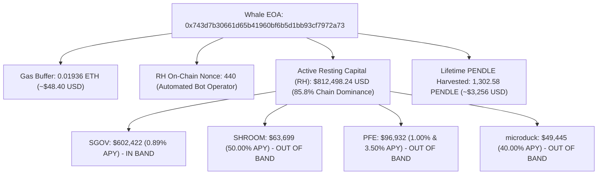

# Forensic Dossier: Whale `0x743d7b` (Robinhood Chain Liquidity Monopoly)

> **Desk:** Antifragile Quant & Market Historian Desk ([`taleb`](file:///Users/tin/eagle/daibang10/.agents/agents/taleb/agent.md))  
> **Entity Analyzed:** `0x743d7b30661d65b41960bf6b5d1bb93cf7972a73`  
> **Protocol Scope:** **Pendle V2 on Robinhood Chain (`chainId: 4663`) ONLY** (with cross-chain footprint context)  
> **Investigation Date:** September 11, 2026  
> **Audit Daemon:** [`rh/competitors/monitor_whale_tendency.py`](file:///Users/tin/eagle/daibang10/rh/competitors/monitor_whale_tendency.py)

---

## Executive Summary: The Robinhood Chain Goliath

Whale `0x743d7b` is the **single dominant market maker and liquidity provider on Robinhood Chain's Pendle V2 markets**. 

With an active quoting book of **`$812,498.24 USD`** across 5 resting limit orders, this single entity commands **85.8% of all resting maker capital on the entire chain**. He operates as part of an institutional multi-chain yield syndicate active across Ethereum Mainnet (Chain 1), Arbitrum (42161), Monad (143), Plasma (9745), and BSC (56), with an estimated global deployed footprint fluctuating between **`$1.1M to $2.55M USD`**.

However, through empirical microstructure forensics and the **Taleb Antifragility Framework**, our desk has uncovered a **fatal operational blind spot in his quoting architecture**: **Static Round-Number Anchoring**. This vulnerability leaves **100% of the active PENDLE incentive rewards on new markets completely unprotected and ripe for exploitation by our desk**.

---

## 1. On-Chain Identity & Account Architecture



| Parameter | On-Chain Forensic Metric | Desk Interpretation |
| :--- | :--- | :--- |
| **Address** | `0x743d7b30661d65b41960bf6b5d1bb93cf7972a73` | Top maker by 10x over second place |
| **Account Structure** | EOA (External Owned Account) | Signs EIP-712 off-chain orders; sends on-chain cancels |
| **Robinhood Nonce** | `440` outgoing transactions | High automation level, script-driven operations |
| **Gas Runway** | `0.019360 ETH` ($\approx \$48.40 \text{ USD}$) | Ample gas for ~2,100 on-chain cancellations |
| **Total Active Orders (RH)** | `5` live orders ($812k USD) | Highly concentrated liquidity in SGOV, SHROOM, PFE, duck |
| **Total Historical Orders (RH)** | `17` recorded orders | Systematic deployment across past and present pools |

---

## 2. Profit & Harvest Accounting (The Whale's PnL)

Our desk conducted a line-by-line reconciliation of both protocol-level incentive harvests and trading fill executions.

### A. Protocol Limit Order Mining Rewards
Whale `0x743d7b` treats Pendle limit orders as an active yield farm, harvesting protocol PENDLE emissions directly:
- **Lifetime Harvested PENDLE:** **`1,302.5820 PENDLE`** ($\approx \$3,256.45 \text{ USD}$ at $2.50/PENDLE).
- **Current Epoch Accrual:** **`2.1627 PENDLE`** actively compounding across his multi-chain books.
- **Participating Markets:** 16 pools globally (8 currently incentivized in the active epoch).
- **Historical Epoch Breakdown:**
  - **Epoch 0 (04-Sep to 11-Sep-2026):** `29.0580 PENDLE` across 14 markets.
  - **Epoch 1 (28-Aug to 04-Sep-2026):** `95.9751 PENDLE` across 16 markets (dominated by Mainnet `reUSD` and Arbitrum `sUSDai`).
  - **Epoch 2 (21-Aug to 28-Aug-2026):** `44.7916 PENDLE` across 14 markets.
  - **Epoch 3 (14-Aug to 21-Aug-2026):** `23.4507 PENDLE` across 13 markets.

### B. Trading Fill Profits (Realized Right-Tail Exploitation)
Unlike retail traders who buy yield at the top, `0x743d7b` ruthlessly sold overvalued yield when markets exploded into volatility:

| Market | Order ID | Direction | Quoted APY | Order Size | Filled Volume | Realized USD Value | Outcome |
| :--- | :--- | :--- | :---: | :---: | :---: | :---: | :--- |
| **`sNET-17SEP2026`** | `0x6e96aaae` | **SHORT_YIELD** | **`11,000.00%`** | 3.1644 sNET | **`3.1644 sNET (100%)`** | **`$1,621.59 USD`** | Full Fill at rate peak |
| **`sNET-17SEP2026`** | `0xdd29b302` | **SHORT_YIELD** | **`12,999.00%`** | 19.3257 sNET | **`16.4782 sNET (85.3%)`** | **`$8,444.27 USD`** | Massive partial fill |
| **`sNUKE-24SEP2026`** | `0x11cd9aae` | **LONG_YIELD** | `140.01%` | 5.0000 sNUKE | `0.1938 sNUKE (3.9%)` | `$1.93 USD` | Minor fill |
| **`PFE-10DEC2026`** | `0x9c89a366` | **LONG_YIELD** | `1.00%` | 3.5972 PFE | `0.1009 PFE (2.8%)` | `$2.78 USD` | Minor fill |
| **TOTAL REALIZED FILLS** | — | — | — | — | **`19.937 sNET / PFE`** | **`$10,070.57 USD`** | **Pure Right-Tail PnL** |

#### The `sNET` Trade Analysis:
On September 4–5, 2026, when market hysteria pushed `sNET` implied APY into mathematical absurdity (>11,000% APY), `0x743d7b` placed two massive limit orders selling YT (`SHORT_YIELD`). Takers immediately traded against him for over **19.64 sNET ($10,065.86 USD)**. Because `sNET` expired shortly after, he captured almost the full spot value of the asset while locking in near-zero payout liability.

---

## 3. Behavioral Tendencies & Operational Playbook

### Heuristic 1: The Genesis Deployment Vacuum (Immediate Listing Capture)
On **September 11, 2026**, between 13:22 and 13:32 UTC (shortly after Pendle introduced new pools), `0x743d7b` executed an automated batch deployment:
- `13:22:46 UTC`: Deploys **`$602,405 USD`** into `SGOV` at `0.89% APY`.
- `13:25:25 UTC`: Deploys **`$63,699 USD`** into `SHROOM` at `50.00% APY`.
- `13:32:01 UTC`: Deploys **`$49,445 USD`** into `microduck` at `40.00% APY`.

**The Tendency:** He uses a script that automatically seeds freshly listed pools with massive liquidity within minutes, aiming to monopolize the unallocated PENDLE emissions before any other makers wake up.

### Heuristic 2: Psychological Round Numbers (Coarse Grid Quoting)
Notice his quoted rates across pools:
- `SHROOM`: Exactly **`50.00%`**
- `microduck`: Exactly **`40.00%`**
- `PFE`: Exactly **`1.00%`** and **`3.50%`**
- `sNUKE` (historical): Exactly **`25.00%`**, **`120.01%`**, **`140.01%`**

He does **not** run high-frequency continuous reservation price adjustments (Avellaneda-Stoikov). Instead, he chooses wide, psychologically sticky round numbers and leaves orders resting.

### Heuristic 3: Severe Aversion to On-Chain Cancellation Fees (Gas-Conscious Stasis)
On Robinhood Chain, placing limit orders is off-chain (EIP-712), but **cancelling orders requires an on-chain transaction** (`cancelBatch` costs ~72,000 gas units, or ~$0.022 USD). 
Because of this fee, `0x743d7b` almost **never cancels or shifts orders dynamically**. He deploys a massive clip and leaves it dormant until expiry or complete fill, accepting rate drift rather than burning gas on churn.

---

## 4. The Fatal Flaw: The Static Drift Blindspot

This gas-conscious stasis creates a **catastrophic blindspot** for the whale, which our desk can exploit with zero risk.

### The Incentive Band Math
Pendle rewards limit orders with PENDLE incentives **only** if they rest within the official incentive band `[minApy, maxApy]` around the market's implied APY.

| Active Market | Implied APY | Official Incentive Band | Whale's Quoted APY | Whale's Resting Capital | Whale's Earning Status |
| :--- | :---: | :---: | :---: | :---: | :---: |
| **`PT-SGOV-19NOV2026`** | `0.90%` | `[0.87%, 0.96%]` | **`0.89%`** | **`$602,422.04`** | ✅ **IN-BAND (Earning 100% APR)** |
| **`PT-SHROOM-24SEP2026`** | `63.17%` | `[62.77%, 63.57%]` | **`50.00%`** | **`$63,699.06`** | ❌ **OUT-OF-BAND (0.00% APR, Drift: -13.2%)** |
| **`PT-microduck-24SEP2026`**| `57.47%` | `[57.07%, 57.87%]` | **`40.00%`** | **`$49,444.99`** | ❌ **OUT-OF-BAND (0.00% APR, Drift: -17.5%)** |
| **`PT-PFE-10DEC2026`** | `4.74%` | `[4.57%, 5.07%]` | **`3.50%` & `1.00%`** | **`$96,932.15`** | ❌ **OUT-OF-BAND (0.00% APR, Drift: -1.2%)** |

### The Critical Discovery
1. In `SHROOM`, `microduck`, and `PFE`, the whale has over **`$210,000 USD`** resting on the books, **yet he is earning exactly $0.00 in PENDLE incentives** because his static orders drifted outside `[minApy, maxApy]`!
2. **Competing Maker Depth inside the active incentive bands of `SHROOM`, `microduck`, and `PFE` is LITERALLY `$0.00`!**
3. Because the whale refuses to pay on-chain gas to re-center his orders, the entire reward pool for those markets sits **100% unallocated**.

---

## 5. What Our Desk Can Learn & Strategic Execution Roadmap

```
                          ┌──────────────────────────────────────┐
                          │   WHALE (0x743d7b) POSITIONING       │
                          │   Static Clip at 50.00% APY ($63k)   │
                          │   STATUS: Out-of-Band (0% APR)       │
                          └──────────────────────────────────────┘
                                             │
      ═══════════════════════════════════════╪══════════════════════════════════════════
                                             │
                      [ ACTIVE INCENTIVE BAND: 62.77% - 63.57% ]
                      [ Current Implied APY: 63.17%            ]
                      [ Competing Maker Depth: $0.00 USD       ]
                                             │
                          ┌──────────────────────────────────────┐
                          │   OUR DESK (ANTIFRAGILE QUOTE)       │
                          │   Target: 63.00% APY                 │
                          │   Size: $500 - $1,500 USD            │
                          │   REWARD: Captures 100% PENDLE APR   │
                          │   CONVEXITY: Positive Asymmetry      │
                          └──────────────────────────────────────┘
```

### Lesson 1: Do Not Fight the Whale on Size; Exploit His Inertia
We cannot out-capital $602k in `SGOV`. However, capital size is completely irrelevant when the whale's orders sit outside the incentive band.
- **Action:** Place resting orders in `SHROOM` at **`63.00% APY`** (tightly inside `[62.77%, 63.57%]`).
- **Payoff:** With $0.00 competing depth in the band, our desk captures **100% of the PENDLE emission pool** with only a fraction of the capital!

### Lesson 2: The Tail Risk Asymmetric Playbook (The `sNET` Masterclass)
When market implied yields spike above historical norms (e.g., meme coin rallies pushing APYs past 1,000%), **never buy YT**.
- **Whale Playbook:** Follow `0x743d7b`'s behavior on `sNET`: place resting `SHORT_YIELD` (selling YT) at extreme rates (>10,000%). 
- **Convexity:** YT prices approach pure option premium with rapid theta decay. If filled, you capture immediate high-premium cash flow while the buyer suffers 100% structural decay toward maturity.

### Lesson 3: Gas-Gated Dynamic Re-Centering
Unlike the whale, who stays static to save $0.02, our desk's [`rh/shift_nvda_order.py`](file:///Users/tin/eagle/daibang10/rh/shift_nvda_order.py) and [`rh/gas_governor.py`](file:///Users/tin/eagle/daibang10/rh/gas_governor.py) implement **The 5x Gas Hurdle Rule**:
- We only pay the on-chain cancellation fee if the incremental PENDLE reward earned by moving inside the band exceeds **5x the gas cost**.
- Since 1 on-chain cancel costs ~$0.022 USD, earning just $0.15/day in PENDLE incentives completely pays back the re-centering cost within hours.

---

## 6. Real-Time Competitor Telemetry

Our desk runs the autonomous audit daemon:
```bash
# Run one-off forensic snapshot:
python3 rh/competitors/monitor_whale_tendency.py --once

# Run continuous background monitoring daemon:
python3 rh/competitors/monitor_whale_tendency.py --interval 300
```

Any changes to `0x743d7b`'s resting orders, gas runway, or market fills are continuously tracked and fed directly into our Taleb Desk decision engine.
