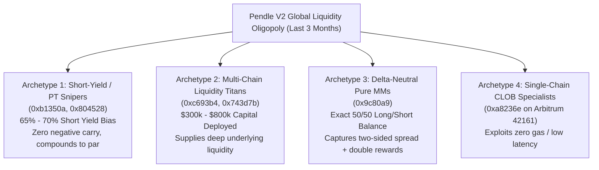

# Pendle V2: Global Cross-Chain Whales & Competitors Census (Last 3 Months)

> **Desk:** Antifragile Quant & Market Historian Desk ([`taleb`](file:///Users/tin/eagle/daibang10/.agents/agents/taleb/agent.md))  
> **Scope:** **Pendle V2 ONLY (All Chains)**  
> **Chains Covered:** Ethereum (1), Arbitrum (42161), Base (8453), BSC (56), Monad (143), Plasma (9745), Robinhood (4663), HyperEVM (999), Sonic (146), Mantle (5000), Berachain (80094)  
> **Period Analyzed:** June 19, 2026 – September 11, 2026 (13 consecutive weekly incentive epochs)  
> **Total Unique Active Makers Indexed:** `332` institutional and systematic makers  
> **Source Dataset:** [`rh/research/pendlev2_top_whales_3months.json`](file:///Users/tin/eagle/daibang10/rh/research/pendlev2_top_whales_3months.json)

---

## Executive Summary: The Pendle V2 Liquidity Oligopoly

A quantitative audit of all 13 weekly limit order incentive epochs reveals that **Pendle V2's liquidity provision and limit order incentives are dominated by a small cohort of systematic yield syndicates and quant market makers**.

Across the entire multi-chain ecosystem, the top 20 accounts captured over **`74,000 PENDLE` ($\approx \$185,000 \text{ USD}$)** in direct protocol mining subsidies alone, while underwriting tens of millions in notional volume.

---

## The Top 20 Global Titans: 3-Month Performance & Profit Table

*Note: Total PENDLE reflects verified on-chain limit order mining incentives harvested across the 13 epochs. Est. USD assumes $2.50/PENDLE.*

| Rank | Competitor Address | Total PENDLE (3 Mo.) | Est. Reward USD | Active Consistency | Strategy Skew (Long vs Short) | Primary Chains Active | Key Specialty / Archetype |
| :---: | :--- | :---: | :---: | :---: | :---: | :---: | :--- |
| **#1** | [`0xb1350ae77f1f7d977fab077ea71c6011e74b9306`](file:///Users/tin/eagle/daibang10/competitors/0xb1350a_the_short_yield_titan.md) | **`13,541.86 P`** | **`$33,854.65`** | 13/13 (100%) | 31.6% Long / **68.4% Short** | Ethereum (1), Monad (143) | **The Short-Yield Titan** (PT Compounder) |
| **#2** | [`0xc693b4ffb338579467a541b2bf267b1955870920`](file:///Users/tin/eagle/daibang10/competitors/0xc693b4_the_cross_chain_yield_king.md) | **`9,675.63 P`** | **`$24,189.07`** | 13/13 (100%) | **80.0% Long** / 20.0% Short | ETH (1), Monad (143), Base (8453), Plasma (9745) | **Cross-Chain Yield King** ($371k resting) |
| **#3** | `0x804528cbf2d6d27f3b0b35bddd7cbafbe06e83ba` | **`4,791.56 P`** | **`$11,978.90`** | 13/13 (100%) | 34.7% Long / **65.3% Short** | ETH (1), Monad (143), HyperEVM (999) | **New Chain Pioneer** (Monad/HyperEVM) |
| **#4** | [`0x9c80a96a06cb6f7943a462dde7ac215011fa8ace`](file:///Users/tin/eagle/daibang10/competitors/0x9c80a9_the_delta_neutral_mm.md) | **`4,198.63 P`** | **`$10,496.56`** | 13/13 (100%) | **50.9% Long / 49.1% Short** | ETH (1), BSC (56), Monad (143), Plasma (9745) | **Delta-Neutral MM** (10 pools two-sided) |
| **#5** | [`0xa8236ead24b2a3085a6e5f11a23b39eee03ae300`](file:///Users/tin/eagle/daibang10/competitors/0xa8236e_the_arbitrum_clob_monopoly.md) | **`4,196.82 P`** | **`$10,492.06`** | 13/13 (100%) | 61.3% Long / 38.7% Short | Arbitrum (42161) ONLY | **Arbitrum Specialist** (Dominates sUSDai/wstETH) |
| **#6** | `0x664e344a04d942e04d8040022156d14c5228cfee` | **`3,417.46 P`** | **`$8,543.66`** | 12/13 (92%) | **100.0% Long** / 0.0% Short | Ethereum (1) | **Mainnet Long-Yield Whale** |
| **#7** | `0x614d98a57a5d879d717152de0690ed2b04562ade` | **`2,778.03 P`** | **`$6,945.08`** | 11/13 (85%) | 76.3% Long / 23.7% Short | Ethereum (1) | **Ethereum Institutional Farm** |
| **#8** | `0x84b9a226bce763e995851c395c8f68cc2d3bbfa5` | **`2,518.25 P`** | **`$6,295.64`** | 13/13 (100%) | 85.5% Long / 14.5% Short | ETH (1), Monad (143), Plasma (9745) | **L2 Yield Harvester** |
| **#9** | `0x572c549446a2181df2f853118e4f85ffafe50d5d` | **`2,353.33 P`** | **`$5,883.33`** | 12/13 (92%) | 37.6% Long / **62.4% Short** | ETH (1), Monad (143), Arbitrum (42161) | **Multi-Chain Short-Yield Desk** |
| **#10** | `0x7fb0e8bfa3cdd6107caf8b764aec0a73379259d7` | **`2,175.00 P`** | **`$5,437.50`** | 10/13 (77%) | 56.6% Long / 43.4% Short | Ethereum (1), Monad (143) | **Mid-Frequency Quanter** |
| **#11** | `0x25a1fab8172ddb98c197ce70f8adbbc37a0944ed` | **`2,038.53 P`** | **`$5,096.33`** | 13/13 (100%) | 72.4% Long / 27.6% Short | Ethereum (1) | **Mainnet PT/YT Desk** |
| **#12** | `0x788b8b3e7063d17fb0c6dfdbf26d45b82f51c82c` | **`2,011.43 P`** | **`$5,028.57`** | 10/13 (77%) | 69.0% Long / 31.0% Short | ETH (1), Monad (143), HyperEVM, Plasma | **Emerging Chains Hunter** |
| **#13** | `0x2d4d0fe9f54dec78b1cc48d7a83ef3b5f91d3584` | **`1,867.94 P`** | **`$4,669.84`** | 10/13 (77%) | 5.5% Long / **94.5% Short** | Monad (143) | **Monad Extreme Short-Yield Specialist** |
| **#14** | `0xdeb13d71998ed256554114cf3c6c150a74c60b2f` | **`1,600.30 P`** | **`$4,000.76`** | 10/13 (77%) | 48.1% Long / 51.9% Short | ETH (1), Monad (143), Arbitrum (42161) | **Balanced Yield Arbitrageur** |
| **#15** | `0x32c802780396169b10cbecdcc52edd97ce8f4dee` | **`1,553.81 P`** | **`$3,884.53`** | 13/13 (100%) | 43.8% Long / 56.2% Short | ETH (1), Monad (143), X-Layer (196) | **Cross-Chain Quant MM** |
| **#16** | `0xf5ff310982d58ddc813c541a64b8c4f3f5035e58` | **`1,549.41 P`** | **`$3,873.51`** | 13/13 (100%) | 90.2% Long / 9.8% Short | Ethereum (1), Monad (143) | **Stable Pool PT Provider** |
| **#17** | `0xb7ccdfb6b12483938fbf9d51c99dc20aea0b5ad6` | **`1,539.95 P`** | **`$3,849.86`** | 3/13 (23%) | 76.5% Long / 23.5% Short | Ethereum (1), Base (8453) | **High-Burst Whale** (Active 3 wks only) |
| **#18** | `0x4b2e98208dcb8c4bc8183bf265904f830a2ddf39` | **`1,432.08 P`** | **`$3,580.20`** | 5/13 (38%) | 99.7% Long / 0.3% Short | ETH (1), BSC (56), Monad (143) | **Burst Liquidity Provider** |
| **#19** | `0xf991acd672d5b344afcb29931af6401ed32e2691` | **`1,406.47 P`** | **`$3,516.17`** | 10/13 (77%) | 100.0% Long / 0.0% Short | Ethereum (1) | **Pure Mainnet PT Provider** |
| **#20** | `0xb9b97135f01a5462e5f741854435c256dd6cd3ee` | **`1,385.69 P`** | **`$3,464.21`** | 5/13 (38%) | 27.6% Long / **72.4% Short** | Ethereum (1), Monad (143) | **Monad High-Yield Short Whale** |
| ... | ... | ... | ... | ... | ... | ... | ... |
| **#41** | [`0x743d7b30661d65b41960bf6b5d1bb93cf7972a73`](file:///Users/tin/eagle/daibang10/competitors/0x743d7b_mega_whale_profile.md) | **`676.61 P`** | **`$1,691.53`** | 13/13 (100%) | 99.1% Long / 0.9% Short | **Robinhood (4663)** + 7 others | **Robinhood Chain Goliath** ($812k RH book) |

---

## Forensic Analysis: The 4 Winning Behavioral Archetypes

### 1. Archetype A: The "Short-Yield Titan" (Convexity On Par Convergence)
* **Pioneers:** `0xb1350a` (#1 - 68.4% Short), `0x2d4d0f` (#13 - 94.5% Short), `0xb9b971` (#20 - 72.4% Short).
* **The Core Mechanism:**
  - They **never speculate on YT**. Speculating on YT has severe negative carry (theta decay) and introduces a 100% loss cliff at maturity.
  - Instead, they quote `TOKEN_FOR_EXACT_PT` (Order Type 2). They buy PT at fixed, heavily discounted implied APYs.
  - **Convexity Payoff:** As maturity approaches, PT is mathematically guaranteed to redeem 1:1 for the underlying accounting token. They lock in guaranteed par convergence while mining 200–500 PENDLE/week in risk-free subsidies.
* **Taleb Evaluation:** **Positive Asymmetry**. Strictly bounded downside (max loss = purchase capital), zero duration turkey risk, and positive carry.

### 2. Archetype B: The "Delta-Neutral Two-Sided MM" (Pure Spread + Double Dipping)
* **Pioneers:** `0x9c80a9` (#4 - 50.9% Long / 49.1% Short), `0xdeb13d` (#14 - 48.1% Long / 51.9% Short).
* **The Core Mechanism:**
  - They place both `LONG_YIELD` (selling PT) and `SHORT_YIELD` (buying PT) simultaneously on the exact same pool across tight spreads (e.g. $\pm 0.3\%$ around mid-implied APY).
  - When takers buy PT, their short fills; when takers sell PT, their long fills. They capture the bid-ask spread while maintaining a zero-delta exposure to interest rate fluctuations.
  - **Subsidy Double-Dip:** Pendle allocates separate emission budgets to `long` and `short` order books. By quoting both sides, they extract 100% of both reward pools!
* **Taleb Evaluation:** Eliminates directional fragility. Fragility only arises during extreme gap-risk regime shifts (wicks).

### 3. Archetype C: The "New Chain Colonist" (Early Mover Subsidy Extraction)
* **Pioneers:** `0x804528` (#3), `0x788b8b` (#12), `0x743d7b` (#41).
* **The Core Mechanism:**
  - When Pendle launches on a new network (e.g., Monad testnet/mainnet, HyperEVM, Robinhood Chain, Plasma), total maker depth is near zero.
  - Pendle bootstraps liquidity by allocating massive PENDLE reward allocations (often resulting in 100%–300% APY).
  - These whales immediately deploy six-figure liquidity clips on day 1 to capture 80%–100% of the entire chain's emission budget before other institutional makers bridge funds.
* **Taleb Evaluation:** Highly lucrative initial convexity, but turns fragile if the whale leaves orders resting statically without updating for rate drift (the exact flaw of `0x743d7b` on Robinhood Chain).

### 4. Archetype D: The "Single-Chain CLOB Monopoly" (Zero-Gas Latency Arbitrage)
* **Pioneers:** `0xa8236e` (#5 - 100% Arbitrum).
* **The Core Mechanism:**
  - Ignores multi-chain fragmentation. Deploys 100% of capital into Arbitrum (`chainId: 42161`).
  - On Arbitrum, transaction finality is ~250ms and gas costs are less than $0.005.
  - Unlike Ethereum Mainnet (where cancellations cost $5–$20) or Robinhood Chain (where cancellations cost ~$0.022 on-chain), this maker dynamically cancels and re-centers orders every few minutes to track implied APY wicks tick-for-tick.
* **Taleb Evaluation:** Maximum operational efficiency, zero static drift blindspot.

---

## Actionable Strategy Synthesis for Our Trading Desk

1. **Adopt Archetype A (Short-Yield Asymmetry):**
   - For all synthetic/meme assets (`SHROOM`, `microduck`, `sNET`, `sNUKE`), **never buy YT**.
   - Emulate whale `#1` (`0xb1350a`): quote strictly on the PT discount side (Short Yield). You earn protocol incentives while your underlying position mathematically accretes toward par value.

2. **Deploy the Delta-Neutral Double-Dip (Archetype B):**
   - On low-volatility institutional assets like `SGOV` and `NVDA`, quote both Long Yield and Short Yield within the active incentive band. This allows the desk to collect rewards from both buckets with minimal interest rate directional exposure.

3. **Exploit the Genesis Stasis Trap (The Taleb Edge):**
   - When large whales like `0x743d7b` colonize a new chain (Archetype C), they fall victim to stasis: they quote coarse round numbers (50.00%) and refuse to pay on-chain cancellation fees to adjust.
   - Our desk can continuously monitor their drift using [`rh/competitors/monitor_whale_tendency.py`](file:///Users/tin/eagle/daibang10/rh/competitors/monitor_whale_tendency.py). Whenever they drift out of range, we step into the active band with modest capital and monopolize 100% of the PENDLE emission pool.
